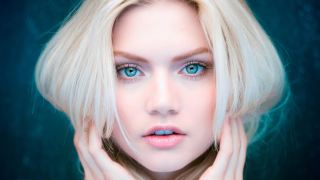

The image.tga must be 320x200 256-color indexed and top-left origin.

Original image: .

Rescaled images: 320x200
With custom palette: 
With VGA default palette: 

Compile on Linux/Windows:

  nasm -fobj -o girl.obj girl.asm

Link with TLINK (DosBOX):

  tlink /x girl.obj, girl.exe
