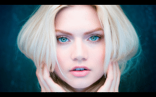
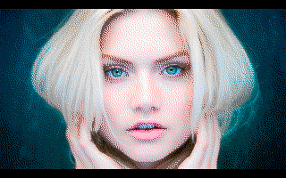

The image.tga must be 320x200 256-color indexed and top-left origin.

Original image: 
 

Rescaled images: 320x200

With custom palette:
 

With VGA default palette:
 

Compile on Linux/Windows:

  nasm -fobj -o girl.obj girl.asm

Link with TLINK (DosBOX):

  tlink /x girl.obj, girl.exe
